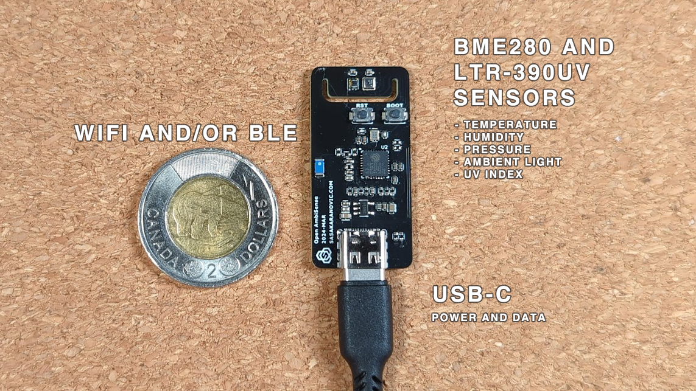
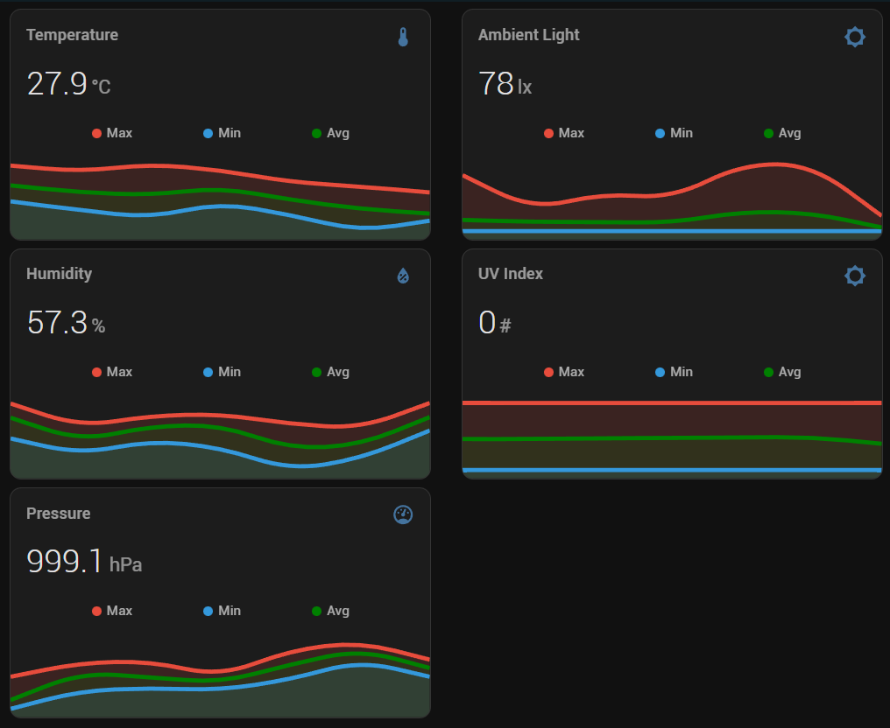

# OpenSENSE - Smart Home Ambient Sensor

## What is this project about?

OpenSENSE is a DIY wireless ambient sensor for smart home and home automation applications.

Easily measure room temperature, humidity, pressure, ambient light and UV index.
The sensor is USB-C powered, \`really tiny\` and light-weight so you can easily mount it almost anywhere.

### Sensor Measurements

- Ambient Temperature
- Relative Humidity
- Barometric pressure
- Ambient Light
- UV Index

### Features

- Small form-factor (measures 40x20mm / 1.58"x0.79")
- USB-C connector for power
- Wireless sensor (WiFi)
- Low-power consumption
- Re-configurable over USB
- Works with HomeAssistant
- Works with ESPHome
- Open-Source and Open-Hardware
- DIY friendly

### Hardware

ESP32-C3 microcontroller - Wi-Fi and Bluetooth 5 (LE) SoC

- BME280 temperature, humidity and pressure sensor
-- Temperature: -40 to +80C temperature range
-- Humidity: ±3% accuracy (20-100% RH)
-- Pressure: RMS noise 0.2Pa, Sensitivity error ±0.25%
- LTR-390UV ambient light and UV sensor
-- Wide dynamic range 1:18.000.000
-- Close to human eye spectral response

Out of the box the sensor is pre-configured to work with HomeAssistant using ESPHome integration. This should allow anyone to get up-an-running in just a couple of simple steps.

## Can I buy OpenSENSE?

Yes you can. It's available on the [web shop](https://shop.sasakaranovic.com/products/opensense).
  

## What platforms are supported?

OpenSENSE is designed to work with ESPHome to allow for quick and easy integration into your Smart Home system.

But it is also a very hacker friendly solution, so you could treat it as a custom board for which you can write your own Arduino/ESP code.

Or you can use any other ESP32 smart home integrations.

You could also use it as a ESP32 development board with BME280 and LTR-390UV sensors.

  

#### Sasa Karanovic

<a href="https://sasakaranovic.com/" target="_blank" title="Sasa Karanovic Home Page"> Home Page</a> &nbsp;&middot;&nbsp;
<a href="https://youtube.com/c/sasakaranovic" target="_blank" title="Sasa Karanovic on YouTube"> YouTube</a> &nbsp;&middot;&nbsp;
<a href="https://github.com/sasakaranovic" target="_blank" title="Sasa Karanovic on GitHub"> GitHub</a> &nbsp;&middot;&nbsp;
<a href="https://twitter.com/_sasakaranovic_" target="_blank" title="Sasa Karanovic on Twitter"> Twitter</a> &nbsp;&middot;&nbsp;
<a href="https://instagram.com/_sasakaranovic_" target="_blank" title="Sasa Karanovic on Instagram"> Instagram</a> &nbsp;&middot;&nbsp;
<a href="https://github.com/sponsors/SasaKaranovic" target="_blank" title="Sponsor on GitHub"> Sponsor on GitHub</a>
